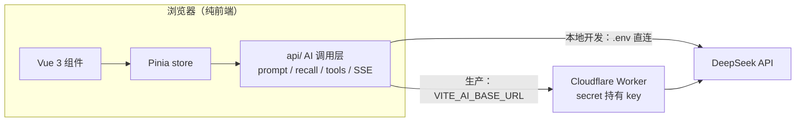

# 对话式 AI 代码片段库

> Vue 3 + TypeScript 纯前端 AI 应用：代码片段管理 + AI 深度集成——对话式检索、库操作提议、代码生成与修改。
> 定位是"代码的第二大脑"：**存得方便、找得快、AI 帮你想**，不做正式 IDE。

    [](LICENSE)

## 界面预览


## 项目简介

纯前端实现的代码片段管理器：localStorage 模拟后端，**无需部署即可跑**，数据完全归用户（JSON 导出备份）。区别于普通收藏工具的核心点：**AI 参与整个工作流**，用大白话找片段、让 AI 帮你改代码、批量整理收藏夹。

- 轻量代码保管：所有设计围绕"存、找、AI"，拒绝 IDE 化
- 无第三方 AI SDK，底层链路手写（SSE / function calling），原理可控可讲
- 在线 Demo：服务端代理已实现（Cloudflare Worker，见 `worker/` 与「部署」），上线后补链接

## 请求链路



## 核心特性

| 能力 | 说明 |
|---|---|
| 对话式片段检索 | 两级召回：本地关键词 Top25 进 prompt + AI 自主分析全库内容；支持主观描述、属性组合、多轮追问 |
| AI 库操作提议 | 删除 / 重命名 / 收藏 / 新建 / 清空 / 收藏夹管理——**AI 只提议、用户确认**，不可逆操作双重确认 |
| 代码生成与修改 | 按描述生成代码 → diff 二次确认 → 另存进编辑器 / 替换原代码（可撤销）/ 导出 |
| 深度思考模式 | 可选推理：先深度思考再作答，复杂需求质量更高；预算不足自动降级并提示 |
| 代码编辑 | Monaco Editor 高亮编辑 + 草稿自动恢复（防误关丢内容） |
| 片段管理 | 收藏夹 / 按语言与最近筛选 / 搜索 / 排序；JSON 导入导出备份 |

## 技术栈

| 层 | 技术 |
|---|---|
| 框架 | Vue 3.5 `<script setup>` + TypeScript + Vite 8 |
| 状态 / 路由 | Pinia / Vue Router 4 |
| 样式 | TailwindCSS 4（zinc 骨架 + GitHub 蓝 `#0969DA`） |
| 编辑器 | Monaco Editor（语言裁剪 72→19） |
| AI | DeepSeek（OpenAI 兼容 API，SSE 流式） |
| 存储 | localStorage（片段/收藏夹）+ sessionStorage（草稿/对话/滚动位置） |

## 快速开始

环境要求：Node.js `^20.19.0 || >=22.12.0`（Vite 8 硬要求，`node -v` 查看）。

```bash
npm install
npm run dev      # 开发（localhost:5173）
npm run build    # 类型检查 + 构建 → dist/
npm run preview  # 本地预览构建产物
```

启用 AI 功能（可选，建议开启，不影响浏览）：

```bash
# 项目根目录建 .env，填入：
VITE_AI_API_KEY=sk-你的key
VITE_AI_MODEL=deepseek-v4-flash   # 可选，默认即可
```

## 部署（可选）

本地开发直连 DeepSeek 即可（key 在 `.env`，只在自己机器）。**生产部署 key 不落前端**：`VITE_` 前缀变量会被 Vite 内联进构建产物，直连部署等于把 key 公开给每个访客——所以生产走 Cloudflare Worker 代理：

```bash
cd worker
npx wrangler deploy                    # 部署 Worker（SSE 流式透传）
npx wrangler secret put AI_API_KEY     # key 只存 Worker 端 secret
npx wrangler secret put ALLOWED_ORIGIN # 可选：限定只允许你的站点域名调用，防站外盗刷
```

前端构建环境设置 `VITE_AI_BASE_URL=https://<worker-name>.<account>.workers.dev` 后重新构建，请求链路变为「浏览器 → Worker（注入 key）→ DeepSeek」，前端产物零密钥。

## 设计决策（含实测）

**性能**
- 首屏轻量化：路由懒加载 + Monaco 按需加载 + 语言裁剪（72→19，tokenizer 按语言懒加载），首屏仅约 123KB JS（gzip）；Monaco（约 4MB，gzip）只在进编辑器时加载
- 空闲预加载 + 弱网保护：浏览器空闲时预热 Monaco，首次进编辑器秒开；2G/3G/低带宽/省流量模式自动跳过
- 白屏期加载占位：`index.html` 静态占位 + 路由就绪门，全程有 loading

**AI 工程**
- 手写 SSE，不用 OpenAI SDK：`fetch` + `ReadableStream` 自解析 `data:` 事件流，原理可控可讲；流式只用于捕获思考过程、驱动阶段指示与进度，文字攒完一次性渲染（避免逐字上屏撞上半截 Markdown）；配套 AbortController 中断、503 退避重试、AIError 错误码体系
- function calling 做动作格式：5 个工具（search / summarize / operate / ask / chat，modify 归入 operate 的 op），格式确定性从 prompt 挪到协议层——API 保证 `arguments` 是合法 JSON。实测：生产同款 prompt + 真实模型 22/22 轮稳定走工具（含注入候选、低预算、超长输入等高压轮次），据此删除手写 JSON 降级解析

**AI 安全**
- 确认执行模型：库操作与代码生成全部放行 AI 提议，用户点确认才落库，不可逆操作再弹一道确认——安全是"错误不可达"（提议错了，不点就不发生），比正则拦截 / 枚举更可靠
- 提示词注入防护：候选片段是用户保存的数据、可能含注入文本，以 `<candidates>` 分隔符包裹 + 安全声明；生成描述 / 修改代码等任务 prompt 以 `<code>` 分隔符同一标准
- 截断显式标记：超长代码进 prompt 前标注「已截断，不要假设未显示部分」——残缺输入不给模型"输入完整"的默认假设
- key 不落前端：直连仅限本地开发；生产经 Cloudflare Worker 注入 key（见「部署」），前端构建产物零密钥

**检索**
- 两级召回，暂不上向量检索：库规模百级以内，全量候选直进 prompt（关键词 Top25 兜底），没有"漏召回"问题——向量检索解决的恰是候选截断后的漏召回，现阶段无收益；上量后演进混合检索（接口不变）。实测：候选单条代码压缩至 1440 字符时深特征查询 0/3，全量 3000 字符 3/3——准确性优先于 token 成本

## 项目结构

```
src/
├── main.ts                 # 入口：注册 Pinia/router、注入 iconfont 雪碧图、空闲预热 Monaco（弱网跳过）
├── router/index.ts         # 路由表（5 条路由 / 4 个页面）
├── views/                  # 只放页面组件（纯组装），零件全在 components/
│   ├── snippet-list/       # / —— 片段列表页（主界面）
│   ├── snippet-detail/     # /snippet/:id —— 阅读 + 复制/导出/AI 入口
│   ├── snippet-editor/     # /snippet/new + /snippet/:id/edit —— Monaco 编辑 + 草稿恢复
│   └── ai-assistant/       # /ai —— AI 助手页（编排者）
├── components/             # global 通用基础 + business 业务组件（判断依据：换项目还能不能用）
│   ├── global/             # base 原子组件 / form / feedback / search / layout / content
│   ├── business/           # snippet 片段 / folder 收藏夹 / assistant AI 助手零件
│   └── editor/             # Monaco 封装：MonacoEditor / DiffView / monaco.ts（裁剪入口）
├── stores/                 # Pinia：snippetStore（片段+收藏夹，watch 自动持久化）/ aiAssistantStore
├── api/                    # AI 调用层（唯一 AI 入口）：assistant 编排 · client SSE · tasks 任务 · prompt/operate/recall/tools 拆分
├── composables/            # useDraft / useMonacoAsync / useClickOutside / useScrollRestore / useGoBack
├── services/               # 纯 TS 不依赖 Vue：storage / seed / languages / sort / file / date
├── types/                  # 领域类型（Snippet / Folder）
├── assets/                 # iconfont 雪碧图
└── style.css               # 全局样式（zinc 层级 / 焦点环 / 过渡）

worker/
├── ai-proxy.js             # Cloudflare Worker：生产 AI 代理（key 存 Worker secret，前端零密钥）
└── wrangler.toml           # Worker 部署配置
```

## Roadmap

- 混合检索：关键词 + embedding + RRF 融合排序，库上量后平滑切换（上层接口已预留）
- Node + SQLite 第二版存储：数据脱离浏览器配额、可迁移，补全栈能力
- 遗留代码库解释器：上传文件集复用现有 AI 管线（检索注入 + 总结 + function calling）

## License

[MIT](LICENSE)

