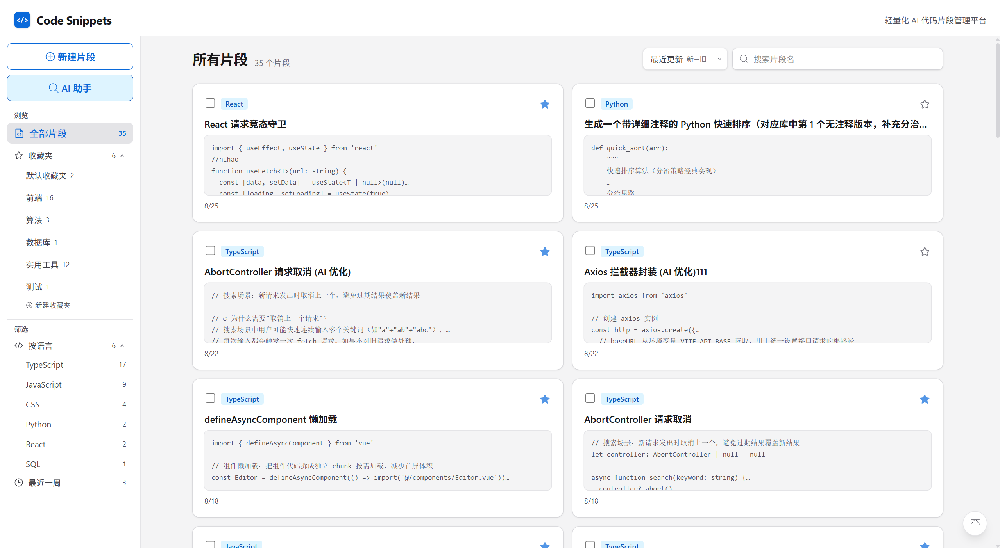
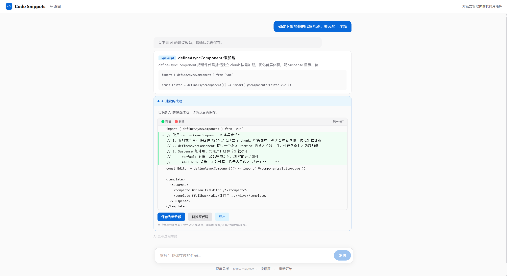
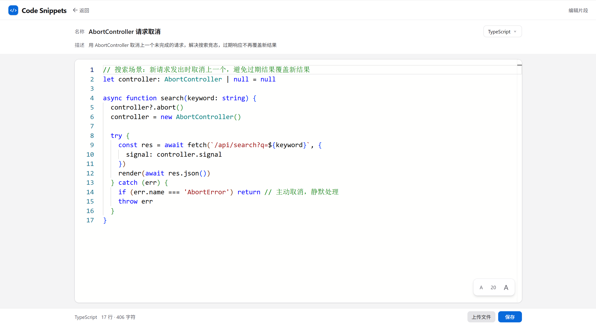

# 对话式 AI 代码片段库

> Vue 3 + TypeScript 纯前端 AI 应用：代码片段管理 + AI 深度集成——对话式检索、库操作提议、代码生成与修改。
> 定位是"代码的第二大脑"：**存得方便、找得快、AI 帮你想**，不做正式 IDE。

    [](LICENSE)

## 界面预览







## 项目简介

纯前端实现的代码片段管理器：localStorage 模拟后端，**无需部署即可跑**，数据完全归用户（JSON 导出备份）。区别于普通收藏工具的核心点：**AI 参与整个工作流**，用大白话找片段、让 AI 帮你改代码、批量整理收藏夹。

- 轻量代码保管：所有设计围绕"存、找、AI"，拒绝 IDE 化
- 无第三方 AI SDK：手写 fetch + SSE 流式 + function calling，底层原理可控可讲
- 部署规划：在线 Demo 构建中（服务端代理转发 AI 请求 + 静态托管），就绪后补链接

## 核心特性

| 能力 | 说明 |
|---|---|
| 对话式片段检索 | 两级召回：本地关键词 Top25 进 prompt + AI 自主分析全库内容；支持主观描述、属性组合、多轮追问 |
| AI 库操作提议 | 删除 / 重命名 / 收藏 / 新建 / 清空 / 收藏夹管理——**AI 只提议、用户确认**，不可逆操作双重确认 |
| 代码生成与修改 | 按描述生成代码 → diff 二次确认 → 另存进编辑器 / 替换原代码（可撤销）/ 导出 |
| 深度思考模式 | 可选推理：先深度思考再作答，复杂需求质量更高；预算不足自动降级并提示 |
| 代码编辑 | Monaco Editor 高亮编辑 + 草稿自动恢复（防误关丢内容） |
| 片段管理 | 收藏夹 / 按语言与最近筛选 / 搜索 / 排序；JSON 导入导出备份 |

## 技术栈

| 层 | 技术 |
|---|---|
| 框架 | Vue 3.5 `<script setup>` + TypeScript + Vite 8 |
| 状态 / 路由 | Pinia / Vue Router 4 |
| 样式 | TailwindCSS 4（zinc 骨架 + GitHub 蓝 `#0969DA`） |
| 编辑器 | Monaco Editor（语言裁剪 72→19） |
| AI | DeepSeek（OpenAI 兼容 API，SSE 流式） |
| 存储 | localStorage（片段/收藏夹）+ sessionStorage（草稿/对话/滚动位置） |

## 快速开始

```bash
npm install
npm run dev      # 开发（localhost:5173）
npm run build    # 类型检查 + 构建 → dist/
npm run preview  # 本地预览构建产物
```

启用 AI 功能（可选，建议开启，不影响浏览）：

```bash
# 项目根目录建 .env，填入：
VITE_AI_API_KEY=sk-你的key
VITE_AI_MODEL=deepseek-v4-flash   # 可选，默认即可
```

## 工程亮点

**性能优化**
- 首屏轻量化：路由懒加载 + Monaco 按需加载，首屏只加载核心壳（约 123KB JS，gzip）；Monaco（裁剪后约 4MB，gzip）只在进编辑器时加载
- Monaco 语言裁剪 72→19，tokenizer 按语言懒加载
- 空闲预加载 + 弱网保护：浏览器空闲时预热 Monaco，首次进编辑器秒开；2G/3G/低带宽/省流量模式自动跳过，避免 4MB 与首屏抢带宽
- 白屏期加载占位：`index.html` 静态占位 + 路由就绪门，全程有 loading

**AI 工程保障**
- SSE 流式接收 + AbortController 中断（流式用于捕获思考过程、驱动阶段指示与进度；文字攒完一次性渲染）
- 503 退避重试 + 错误码体系（AIError 分类）
- function calling 调度 5 个工具（modify 归入 operate 的 op）；AI 只提议、关键操作走用户确认

## 设计决策

- **AI 只提议、用户确认**：库操作与代码生成全部放行 AI 提议，前端确认卡展示操作对象与后果，用户点确认才落库；不可逆操作再弹一道确认。安全模型是"错误不可达"（提议错了，不点就不发生），比正则拦截/枚举更可靠。
- **手写 SSE，不用 OpenAI SDK**：`fetch` + `ReadableStream` 自解析 `data:` 事件流，底层原理可控可讲。流式只用于捕获思考过程、驱动阶段指示与进度计数，文字攒完一次性渲染——避免逐字上屏撞上半截 Markdown。
- **两级召回，暂不上向量检索**：库规模百级以内，全量候选直进 prompt（关键词 Top25 兜底），没有"漏召回"问题——而向量检索解决的恰是候选截断后的漏召回，现阶段无收益；数据上量、候选必须截断时再演进为混合检索（接口不变）。
- **function calling 做动作格式**：AI 操作走 5 个工具（search / summarize / operate / ask / chat），动作格式的确定性从 prompt 挪到协议层——API 保证 `arguments` 是合法 JSON，不再手写括号配平解析。

## 项目结构

```
src/
├── main.ts                 # 入口：注册 Pinia/router、注入 iconfont 雪碧图、空闲预热 Monaco（弱网跳过）
├── router/index.ts         # 路由表（5 条路由 / 4 个页面）
├── views/                  # 只放页面组件（纯组装），零件全在 components/
│   ├── snippet-list/       # / —— 片段列表页（主界面）
│   ├── snippet-detail/     # /snippet/:id —— 阅读 + 复制/导出/AI 入口
│   ├── snippet-editor/     # /snippet/new + /snippet/:id/edit —— Monaco 编辑 + 草稿恢复
│   └── ai-assistant/       # /ai —— AI 助手页（编排者）
├── components/             # global 通用基础 + business 业务组件（判断依据：换项目还能不能用）
│   ├── global/             # base 原子组件 / form / feedback / search / layout / content
│   ├── business/           # snippet 片段 / folder 收藏夹 / assistant AI 助手零件
│   └── editor/             # Monaco 封装：MonacoEditor / DiffView / monaco.ts（裁剪入口）
├── stores/                 # Pinia：snippetStore（片段+收藏夹，watch 自动持久化）/ aiAssistantStore
├── api/                    # AI 调用层（唯一 AI 入口）：assistant 编排 · client SSE · tasks 任务 · prompt/operate/recall/tools 拆分
├── composables/            # useDraft / useMonacoAsync / useClickOutside / useEscape / useGoBack
├── services/               # 纯 TS 不依赖 Vue：storage / seed / languages / sort / file / date
├── types/                  # 领域类型（Snippet / Folder）
├── assets/                 # iconfont 雪碧图
└── style.css               # 全局样式（zinc 层级 / 焦点环 / 过渡）
```

